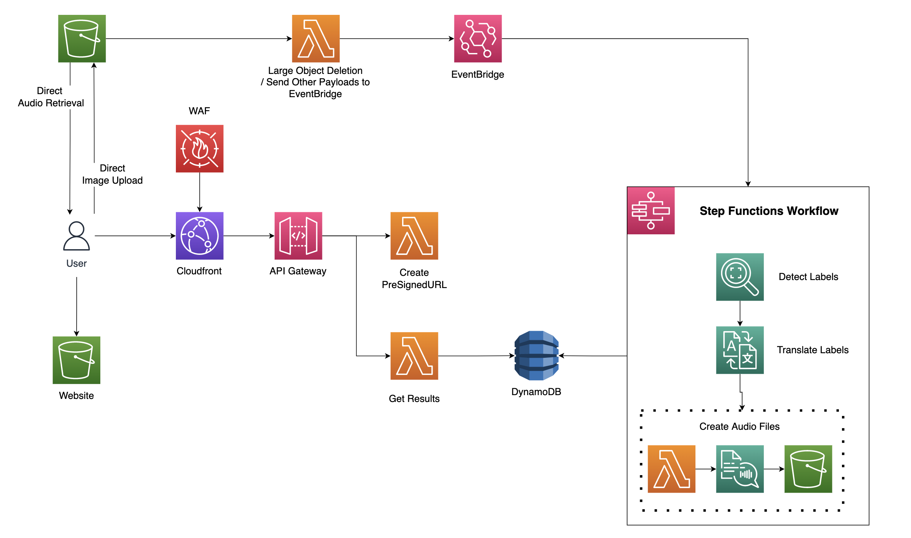

### Detects, translates, and generates audio files for labels in an image - http://development-pantheon-pro-developmentwebsitedeploy-i7e1a2l30gof.s3-website-us-east-1.amazonaws.com/

## How it's made

On a file upload to the input field, a request for a presigned URL is made. The URL is returned, along with a custom ID for the file you are going to upload. This is done to prevent files with duplicate names being overwritten. User uploads the file to S3 directly which triggers a lambda function. It checks the file size and if it's over 1mb, it deletes it.

Note 1: We're not actually checking for appropriate file types, just size.. even with signed POSTs, [there are ways to get around it](https://zaccharles.medium.com/s3-uploads-proxies-vs-presigned-urls-vs-presigned-posts-9661e2b37932). Just.. upload an image (.jpeg, .jpg, .png) pls :)

The function pushes valid files into EventBridge, which triggers a step function workflow. This workflow does a few things:

1. Detect labels in the image
2. Generate translations in 4 languages for that image
3. Add an item to Dynamo with the label and translations
4. Create audio files for each translation
5. Add those files to the same S3 bucket under an `/audio` prefix.

Note 2: Since labels are often similar across many images (human, face, person), audio files ARE NOT generated if the audio file already exists. This is checked with the `HeadObjectCommand` in the `audio-processor` function.

The frontend pulls from the table to get the results. Added Cloudfront and WAF to the API to prevent spam.

### Pre-requisites

1. Install Docker
2. Install CDK v1.44.0
3. Create an AWS account
4. `npm install` & `cdk bootstrap`
5. Create an empty .env.development file

### Commands

`npm run test` - Deploys the entire stack to a **development** environment and runs tests against it

`npm run deploy-dev` Deploys the entire stack

`npm run start` runs the frontend locally, requires the backend to be deployed

### Troubleshooting:

> [internal] load metadata for public.ecr.aws/sam/build-nodejs14.x:latest:
> failed to create LLB definition: unexpected status code [manifests latest]: 403 Forbidden

Run this command: `aws ecr-public get-login-password --region us-east-1 | docker login --username AWS --password-stdin public.ecr.aws/sam/build-nodejs`

> Uploaded file must be a non-empty zip

Delete `cdk.out/.cache` and re-deploy, usually happens when you stop a deployment half way and try to redeploy again
